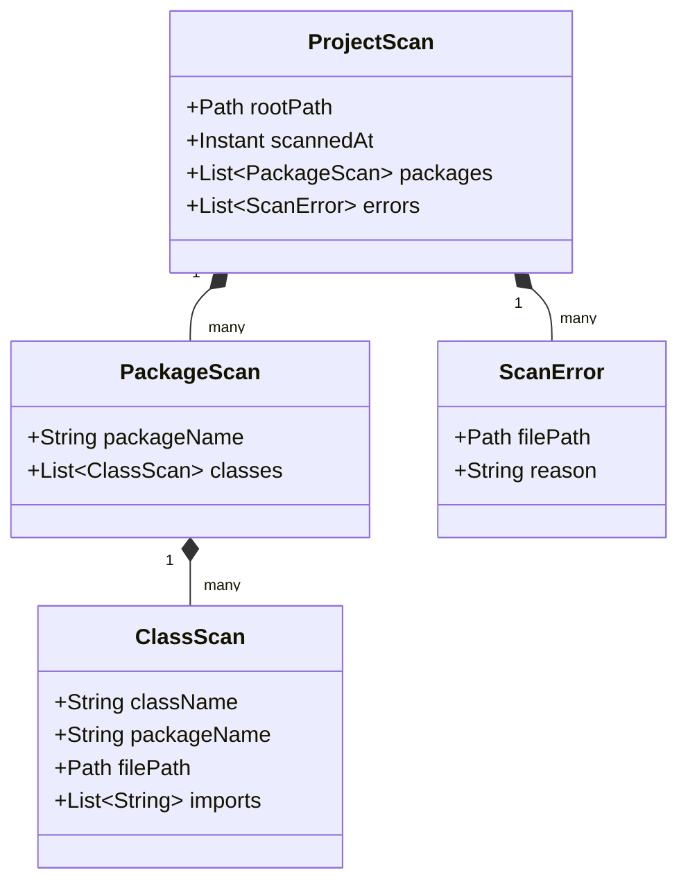
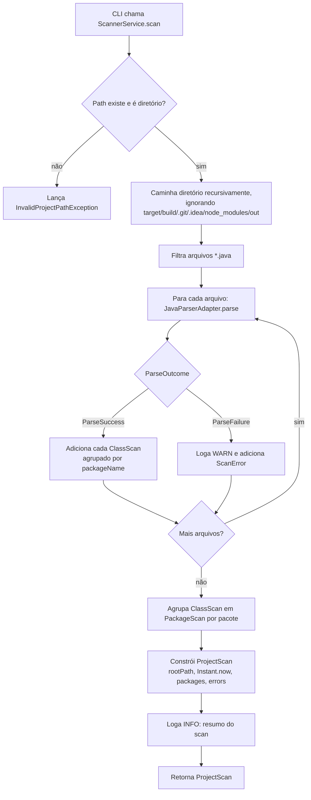

# Spec Técnica — Scanner (`com.arqsync.scanner`)

> **Status:** Rascunho para revisão
> **Baseado em:** `docs/prd/PRD-arqsync.md` (v1, aprovado)
> **Autor:** Everson Rubira (com apoio de Claude)
> **Data:** 2026-08-26

---

## 1. Visão Geral

O Scanner é o componente base do ArqSync: recebe o caminho de um projeto Java, percorre recursivamente seus arquivos `.java` e produz um modelo estrutural fiel do código-fonte — pacotes, classes e imports — sem depender de build tool (Maven/Gradle).

O Scanner **não** detecta ciclos nem violações de camada — isso é responsabilidade da Spec do Analyzer, que consome o modelo (`ProjectScan`) produzido aqui. O contrato do Scanner termina em "aqui está a estrutura real do código"; interpretar essa estrutura é problema de outro componente. Essa separação existe para que o Scanner permaneça simples e testável isoladamente, e para que o Analyzer possa evoluir (novas regras de detecção) sem tocar no parsing.

---

## 2. Decisões de Design

Cada decisão abaixo aplica o princípio Hashimoto: implementar o mínimo que atende aos requisitos do PRD, registrando alternativas descartadas e o porquê.

### D1 — Descoberta de arquivos: caminhada manual de diretório, não `SourceRoot` do JavaParser

- **Alternativa A (descartada):** usar `SourceRoot` do JavaParser, que varre um diretório assumindo que a estrutura de pastas espelha os pacotes (como em `src/main/java`).
- **Alternativa B (escolhida):** caminhar o diretório manualmente (`Files.walk`), filtrando `*.java`, e extrair o nome do pacote da própria declaração `package` dentro do arquivo.
- **Justificativa:** o PRD exige que o scan funcione **sem depender de build tool**. `SourceRoot` assume uma raiz de pacotes previsível (típica de Maven/Gradle), o que não é garantido em um projeto arbitrário. Ler o `package` diretamente do arquivo é a fonte de verdade real e funciona independentemente da estrutura de pastas.

### D2 — Falha de parsing não interrompe o scan

- Implementado via um tipo de retorno explícito (`ParseOutcome`, sealed interface — ver Seção 4) em vez de exceções. O `JavaParserAdapter` nunca lança exceção para erro de sintaxe; ele retorna um resultado de falha que o `ScannerService` loga e agrega como `ScanError`, seguindo para o próximo arquivo.
- **Justificativa:** requisito direto do PRD (seção 3 e 8). Modelar isso como valor de retorno, não exceção, evita `try/catch` espalhado e torna o "arquivo quebrado" um caso esperado do fluxo, não um erro excepcional.

### D3 — Exclusão de diretórios de build/VCS (`target`, `build`, `.git`, `.idea`, `node_modules`, `out`)

- **Alternativa considerada:** respeitar o `.gitignore` do projeto escaneado (mais preciso, porém exige um parser de `.gitignore` — complexidade desnecessária para o v1).
- **Escolha:** uma denylist fixa e simples de nomes de diretório, ignorados durante a caminhada.
- **Justificativa:** escanear artefatos compilados ou gerados (`target/generated-sources`, `.class` reempacotado, etc.) poluiria o diagnóstico com classes duplicadas ou irrelevantes — isso alimenta diretamente o Risco 3 do PRD ("falsos positivos minando a confiança no diagnóstico"). O custo de excluir os diretórios óbvios é mínimo; o de um parser de `.gitignore` não se paga no v1.

### D4 — Pacote default (sem declaração `package`) mapeado para string vazia `""`

- **Justificativa:** é o caso mais simples de representar; evita inventar um valor sentinela (`"(default)"`) que teria que ser tratado como caso especial em todo lugar. Classes no pacote default naturalmente não vão bater com a convenção de nomenclatura (`controller`, `service`, etc.), então não geram violações de camada — apenas participam normalmente da detecção de ciclos.

### D5 — Múltiplos tipos top-level por arquivo geram múltiplos `ClassScan`; tipos aninhados (nested/inner) não são escaneados como entidades separadas

- Um arquivo `.java` pode declarar mais de uma classe/interface/enum top-level (raro, mas válido em Java). Cada um vira um `ClassScan` distinto, compartilhando o mesmo pacote e os mesmos imports do arquivo.
- Classes aninhadas **não** viram `ClassScan` próprios no v1.
- **Justificativa:** violações arquiteturais relevantes (`controller` chamando `repository`) ocorrem no nível de classe top-level na esmagadora maioria dos casos reais. Tratar aninhadas como entidades separadas adicionaria complexidade sem valor comprovado para o objetivo do v1 — fica registrado como possível extensão futura (Seção 7).

### D6 — Sem timeout de parsing

- **Justificativa:** o JavaParser opera inteiramente sobre I/O local (leitura de arquivo em disco), sem chamadas de rede ou recursos externos. Não há cenário plausível de bloqueio indefinido no v1. Adicionar timeout seria tratamento de erro para um cenário que não existe — contrário ao princípio Hashimoto.

### D7 — Scan sequencial, sem paralelismo

- **Justificativa:** o PRD define o alvo de performance como projetos de 50–500 classes, com otimização explicitamente fora do v1. Paralelizar a leitura de arquivos introduziria complexidade (agregação thread-safe, ordenação de erros) sem necessidade real na escala-alvo. Registrado como otimização futura.

### D8 — Logging via SLF4J

- Nível `WARN` para cada arquivo pulado por falha de parsing (com caminho do arquivo e motivo); nível `INFO` para o resumo do scan (total de arquivos encontrados, parseados com sucesso, pulados).
- **Justificativa:** SLF4J é o padrão de fato no ecossistema Java/Spring; qualquer binding (Logback, etc.) pode ser plugado depois sem mudar o código do Scanner.

### D9 — Modelos como Java Records, com cópia defensiva de listas

- `ProjectScan`, `PackageScan`, `ClassScan` e `ScanError` são `record`s. Records do Java 21 dão imutabilidade estrutural, `equals`/`hashCode`/`toString` de graça, e são a forma idiomática de modelar DTOs neste contexto.
- **Atenção:** records **não** copiam coleções automaticamente — o campo `List<...>` exposto pelo acessor gerado é a mesma referência passada no construtor. Por isso, cada record com campo de lista define um construtor compacto que aplica `List.copyOf(...)`, garantindo imutabilidade real (e validação contra `null` de brinde, já que `List.copyOf` rejeita elementos nulos).

### D10 — Imports estáticos e com wildcard são capturados como texto bruto

- O `JavaParserAdapter` armazena o nome do import exatamente como o JavaParser o expõe (`ImportDeclaration.getNameAsString()`), sem tentar normalizar imports estáticos (`import static com.foo.Bar.metodo`) ou wildcard (`import com.foo.bar.*`).
- **Justificativa:** normalizar/interpretar imports para fins de mapeamento pacote-a-pacote é responsabilidade do Analyzer (que precisa decidir, por exemplo, como tratar o membro de um import estático). Fazer isso no Scanner acoplaria as duas specs. Fica registrado como pendência explícita (Seção 7) para a Spec do Analyzer resolver.

---

## 3. Modelos de Dados



```java
package com.arqsync.scanner.model;

public record ClassScan(
    String className,
    String packageName,
    Path filePath,
    List<String> imports
) {
    public ClassScan {
        Objects.requireNonNull(className);
        Objects.requireNonNull(packageName);
        Objects.requireNonNull(filePath);
        imports = List.copyOf(imports);
    }
}

public record PackageScan(
    String packageName,
    List<ClassScan> classes
) {
    public PackageScan {
        Objects.requireNonNull(packageName);
        classes = List.copyOf(classes);
    }
}

public record ScanError(
    Path filePath,
    String reason
) {
    public ScanError {
        Objects.requireNonNull(filePath);
        Objects.requireNonNull(reason);
    }
}

public record ProjectScan(
    Path rootPath,
    Instant scannedAt,
    List<PackageScan> packages,
    List<ScanError> errors
) {
    public ProjectScan {
        Objects.requireNonNull(rootPath);
        Objects.requireNonNull(scannedAt);
        packages = List.copyOf(packages);
        errors = List.copyOf(errors);
    }
}
```

**Nota sobre campos deliberadamente ausentes:** nenhum destes modelos guarda métricas agregadas (contagem de classes, de pacotes, etc.) nem o "tipo" da declaração (classe/interface/enum/record). Métricas descritivas são responsabilidade do Analyzer/Exporter, computadas a partir deste modelo — calculá-las aqui duplicaria lógica entre specs. O "tipo" do declarante não é usado por nenhuma regra do v1 (ciclos e violação de camada dependem só de pacote + imports), então fica de fora.

---

## 4. Interface Pública

```java
package com.arqsync.scanner.service;

public final class ScannerService {

    /**
     * Escaneia recursivamente um projeto Java a partir de {@code projectRoot}.
     * Arquivos que falham no parsing são pulados e registrados em ProjectScan.errors().
     *
     * @throws InvalidProjectPathException se o caminho não existir ou não for um diretório
     */
    public ProjectScan scan(Path projectRoot);
}
```

```java
package com.arqsync.scanner.adapter;

public final class JavaParserAdapter {

    /** Faz o parsing de um único arquivo .java, nunca lançando exceção de sintaxe. */
    public ParseOutcome parse(Path javaFile);
}

public sealed interface ParseOutcome permits ParseSuccess, ParseFailure {}

public record ParseSuccess(List<ClassScan> classes) implements ParseOutcome {}

public record ParseFailure(ScanError error) implements ParseOutcome {}
```

```java
package com.arqsync.scanner.exception;

public class InvalidProjectPathException extends RuntimeException {
    public InvalidProjectPathException(String message) {
        super(message);
    }
}
```

**Sobre visibilidade:** `ScannerService` é o único ponto de entrada pensado para outros módulos (CLI, e futuramente Analyzer/Persistence/Exporter consumindo `ProjectScan`). `JavaParserAdapter` é público por necessidade técnica (está em subpacote diferente dentro do mesmo módulo `scanner`), mas é um colaborador interno — a convenção é que nada fora de `com.arqsync.scanner` o instancie diretamente. Java não tem encapsulamento de subpacote sem JPMS; introduzir módulos Java só para isso seria overengineering no v1, então a fronteira aqui é de convenção, não de compilador.

---

## 5. Fluxo de Execução



1. O caller (CLI) chama `ScannerService.scan(Path.of(caminho))`.
2. `ScannerService` valida que o caminho existe e é um diretório; caso contrário, lança `InvalidProjectPathException` imediatamente (falha rápida — não é o caso de "arquivo com erro", é uso incorreto da ferramenta).
3. Caminha o diretório recursivamente via `Files.walk`, ignorando subárvores cujo nome bate com a denylist (`target`, `build`, `.git`, `.idea`, `node_modules`, `out`).
4. Filtra apenas arquivos terminados em `.java`.
5. Para cada arquivo, chama `JavaParserAdapter.parse(file)`.
6. Em caso de `ParseSuccess`, cada `ClassScan` retornado é agregado, agrupado por `packageName`.
7. Em caso de `ParseFailure`, o `ScanError` é registrado e logado em `WARN`; o scan segue para o próximo arquivo.
8. Ao final da caminhada, os `ClassScan` agregados são agrupados em `PackageScan` por nome de pacote.
9. `ScannerService` constrói e retorna o `ProjectScan` (com `rootPath`, `Instant.now()` como `scannedAt`, os pacotes e os erros), e loga um resumo em `INFO`.

---

## 6. Testes

**Framework:** JUnit 5 + AssertJ (assertions fluentes, facilita legibilidade em listas/coleções).

**Estratégia:** projetos Java fictícios minúsculos como fixtures, em `src/test/resources/fixtures/scanner/<cenario>/`, cada um com 2–4 arquivos `.java` reais (não strings inline), para que o teste exercite o parsing de verdade.

### Fixtures sugeridas
- `valid-project/` — poucos pacotes (`controller`, `service`, `repository`), sem ciclos nem erros
- `project-with-syntax-error/` — um arquivo com erro de sintaxe deliberado, entre arquivos válidos
- `project-with-multiple-types-per-file/` — um arquivo com duas classes top-level
- `project-with-default-package/` — uma classe sem declaração `package`
- `project-with-build-dirs/` — inclui uma pasta `target/` com um `.java` dentro (não deve ser escaneado)
- `empty-project/` — diretório sem nenhum arquivo `.java`

### Casos de teste — `ScannerServiceTest`
- `scan_deveRetornarPacotesEClassesCorretos_quandoProjetoValido`
- `scan_devePularEArquivarErro_quandoArquivoTemErroDeSintaxe`
- `scan_naoDeveEscanearDiretoriosDeBuild_quandoTargetOuBuildPresentes`
- `scan_deveLancarExcecao_quandoCaminhoNaoExiste`
- `scan_deveLancarExcecao_quandoCaminhoNaoEhDiretorio`
- `scan_deveRetornarProjectScanVazio_quandoNaoHaArquivosJava`

### Casos de teste — `JavaParserAdapterTest`
- `parse_deveExtrairPacoteClasseEImports_quandoArquivoValido`
- `parse_deveRetornarParseFailure_quandoArquivoTemErroDeSintaxe`
- `parse_deveRetornarUmClassScanPorTipo_quandoArquivoTemMultiplasClassesTopLevel`
- `parse_deveMapearParaPacoteVazio_quandoArquivoSemDeclaracaoDePackage`

---

## 7. Pendências

- **Interpretação de imports estáticos/wildcard** (mapeamento para pacote de origem) fica para a Spec do Analyzer — o Scanner só captura o texto bruto (D10).
- **Pacotes com mesmo nome em módulos diferentes** (multi-módulo): o v1 do Scanner identifica pacotes só pelo nome, não pelo módulo de origem. Isso é uma simplificação herdada do PRD (que não distingue módulos) — se um projeto multi-módulo tiver dois módulos com pacote `com.foo.service`, o Scanner os funde em um só `PackageScan`. Não é tratado como bug do v1, mas vale registrar para não surpreender.
- **Classes aninhadas (inner/nested) como entidades separadas** — não incluído no v1 (D5); possível extensão futura se a detecção de violações precisar de granularidade maior.
- **Paralelização do scan** — otimização futura, fora do v1 (D7), caso a escala de projetos-alvo cresça além de 500 classes.
